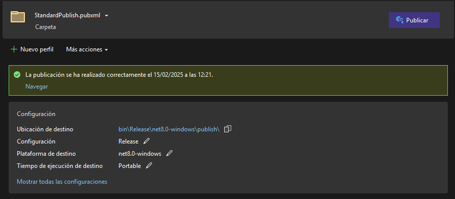
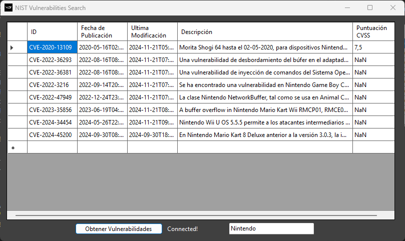

# NIST Vulnerabilities Browser

> Readme in Spanish [README](docs/README_ES.MD)

This program is a Browser that searches in the NIST Vulnerability Database using their API.


The finality of this program is to be an example NUnit testing framework.

For tests information you can check [TESTING](docs/TESTING.md)

## Project compilation.

Requirements:

- Visual Studio 2022
- .NET 8.0
- Moq Framework
- NUnit Framework

Repository's cloning:

```bash
git clone https://github.com/ChaconMoon/NUnit-Project.git
```

Open the project solution in Visual Studio and open the contextual menu of the `App.View` project and go to `Publish`


Create a Profile depending on your Windows architecture (x86, x64, ARM32 or ARM64)



## Operation

The View of the program:
1. Data Table: Shows the results of the API request.
2. Request TextBox: This TextBox contains the name of the program used to send the request to the database.
2. Request Button: This Button sends the request to the API.


This program sends a keyboard search to the Api, it can't search by version of the program.

For more info: [API Reference](https://nvd.nist.gov/developers/vulnerabilities)


