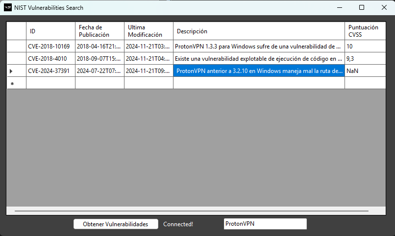
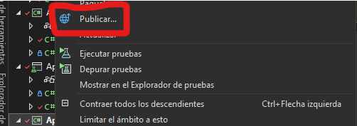
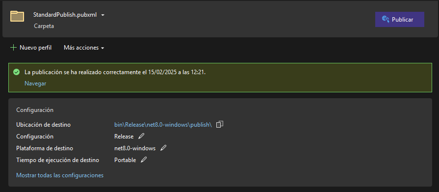
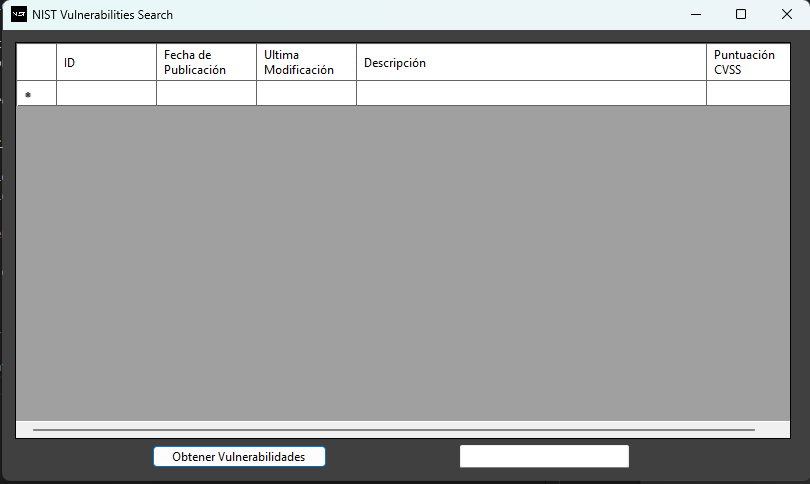
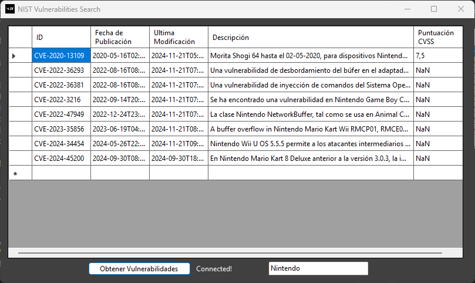

# NIST Vulnerabilities Browser

Este programa permite realizar búsquedas en bruto en la base de datos de vulnerabilidades del NIST (Instituto Nacional de Seguridad y tecnología de los Estados Unidos), esta base de datos tiene una API que permite realizar búsquedas en la base de datos.



La finalidad de este programa no es solo el programa, este programa se hizo con la finalidad de aprender a usar test unitarios.

Para ver el apartado de testing ir a [TESTING](docs/TESTING.md)

## Compilación del proyecto.

Requerimientos:

-  Visual Studio 2022
- .NET 8.0
- Moq Framework
- NUnit Framework

Clonación del repositorio:
```Git
git clone https://github.com/ChaconMoon/NUnit-Project.git
```
Abrir la solución en Visual Studio y haciendo click derecho en el proyecto App.View -> Publish 



crea un perfil de compilación para Windows x86, x64, ARM32 o ARM64 según tu procesador.



## Funcionamiento

El programa tiene 3 componentes:
1. Tabla de datos: Muestra los resultados de la consulta.
2. Campo consulta: El campo en blanco donde se debe poner el nombre del programa.
2. Botón Consulta: Realiza la consulta en base al nombre del programa del textbox de al lado.



Las búsquedas las hace buscando en la Base de datos del NIST realizando una búsqueda en bruto.


Ver mas: [API Reference](https://nvd.nist.gov/developers/vulnerabilities)

