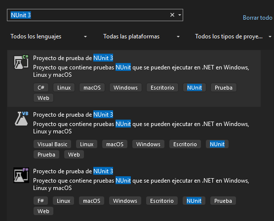

# Testing del proyecto.

Para la realización de los test de este proyecto se ha usado la librería NUnit para .NET Core 8.0

Este es un framework que permite realizar tests unitarios en la plataforma .NET ya sea .NET Core o .NET Framework

## Instalación del Framework

Este framework se puede instalar de 2 formas con el gestor de paquetes NuGet o creando un proyecto de Testing que lo use.

**LA OPCION RECOMENDADA ES INSTALAR UN PROYECTO DE PRUEBAS**

### Instalación mediante un proyecto.

A la hora de crear un proyecto en Visual Studio una de las opciones que nos da son proyectos de prueba de NUnit.

Esto nos creara un proyecto cuyo fin sera testear otros proyectos, en Visual Studio lo veremos asi, lo podremos distingir porque tiene un frasco de laboratorio en su icono.

### Instalación mediante un paquete NuGet.

Si ya tienes el proyecto creado y simplemente quieres añadir la libreria de test debes instalar el paquete NuGet, para ello ve a proyecto -> Administrar paquetes NuGet.

Dentro del gestor de paquetes buscamos los 3 paquetes de NUnit y los instalamos.

Tanto si has creado un proyecto como si lo has instalado manulmente ya puedes crear tests creando clases para ello, puedes comprobar que tienes NUnit Instalado si vas a las dependencias del proyecto y miras si tienes NUnit.

## Creación de Tests

Los tests se crean dentro de las 2 clases clases dentro del proyecto, estas son las classes UnitTest e IntegrationTest.

Estas clases contienen los tests unitarios y un test de integración, primero vayamos con los tests unitarios.

### Test Unitarios (UnitTest.cs)

Los test unitarios buscan testear una parte del código, estos tests buscan asegurar que un fragmento de codigo arroje el resultado deseado para ello se usan metodos que llaman a una función y esperan un resultado esperado, estos tests se deben realizar con independecia del sistema, conexiones u otros medios mas alla del propio codigo del software ya que estos tests solo buscan testear que el digo es correcto y no su funcionamiento.

A continuación voy a explicar como funcionan las diferentes secciones de este fichero:

- #### [SetUp]
Dentro de la clase de los tests unitarios hay una funcion con el atributo SetUp que se inicia al inicio de la ejecución del los test y busca inizializar todos los objetos que se usan en los test de esta clase.

_data: Seusara como un modelo de datos falsos que vamos a usar para los test.

_jsonText: Contiene un json en bruto que se usara para los test que reuieran un JSON.

_docJson: Este objeto se va a convertir en Json serializado en base al testo Json anterior.

_fakeResponse: Este objeto es un Mock que generara un respuesta falsa, lo que es un mock se explicara mas adelante.

_fakeObject: Este es un objeto prefabicado con los datos del Json de los tests para testear sobre la serialización de los Json

Volviendo al metodo Setup dentro de este metodo inicializamos todos estos objetos.

- #### [TearDown]

El metodo etiquetado como Teardown busca ser una especie de recolector de basura que nos permite resear los objetos de los tests antes de cada prueba.

- ### Test del modelo de datos.

En este caso este test busca comprobar una función que checkea si un objeto del modelo de datos esta "completo" No tiene ningun campo en blanco, para ello vamos a usar uno de los metodos de NUnit ``Assert.Pass()`` y ``Assert.Fail()``. Estas 2 funciones tienen como función dar un test por completado o por fallido.

El siguiente test testea la misma función pero usa los metodos ``Assert.IsTrue`` y ``Assert.isFalse`` funcionan de forma similar a los anteriores pero pasan el test o no segun si lo del interior es verdadero o falso.

- ### Test de la vista

El primer test de la vista busca testear si el código del formulario para mostrar los CVE, pero para ello tendríamos que hacer una consulta a la API, pero para que un test unitario sea correcto no debe depender de nada mas allá del propio código, para ello hay que usar lo que se conoce como Mocks.

Un mock consiste en crear una respuesta falsa a una petición a una función, digamos que le estamos diciendo por adelantado a un función que resultado queremos recibir, voy a usar como ejemplo el propio Mock de los test unitarios.

En este mock estamos creando una instancia del controlador en la que vamos a sobrescribir la respuesta de la petición a la API, es decir, le indicamos que objeto es la respuesta, en este caso el json serializado.

Aquí estamos creando un objeto formulario al que le estamos asignando como controlador al controlador con la respuesta falsa de modo que cuando dentro de la función para obtener los CVE en base al json, no hace la petición a la API por lo que este test es independiente de la API.

El siguiente test busca verificar si la asignación de datos la tabla que lo muestra es correcta y para ello recibe el documento json que hemos establecido.

- ### Test del controlador

Estos son los 2 tests que testean en controlador de datos, el primero se encarga de probar si cuando le pasamos un ``Null`` a la función que formatea el json a objetos lanza una excepción, es decir si no la tenemos controlada, para ello se usa el método. 

El último test unitario buscar testear si el formato a objeto del json es correcto, para ello previamente se ha creado un objeto con la respuesta esperada y se compara el json serializado a objetos con la respuesta esperada.

- ### Test de integración

El último test es un test de integración cuya finalidad es testear la conexión con la API asi que le manda una petición a la API pidiendo la información de Wordpress.

